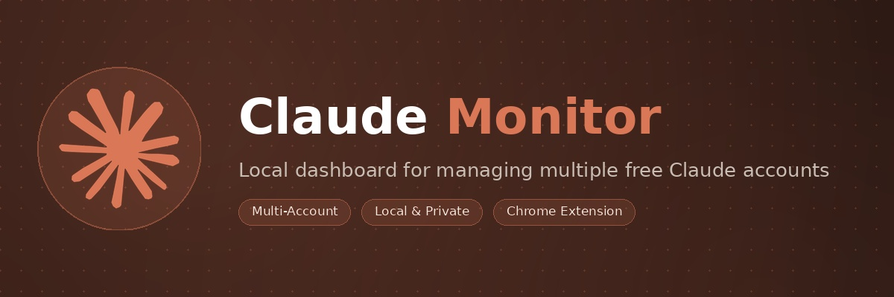
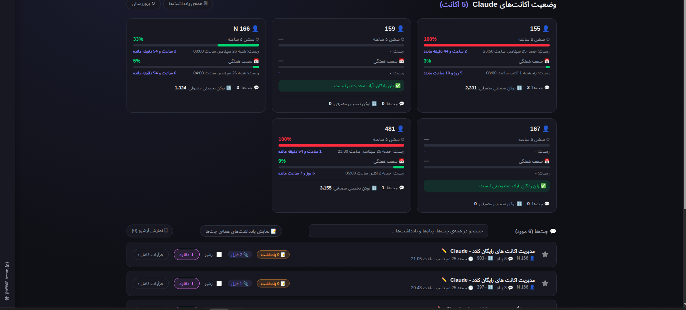
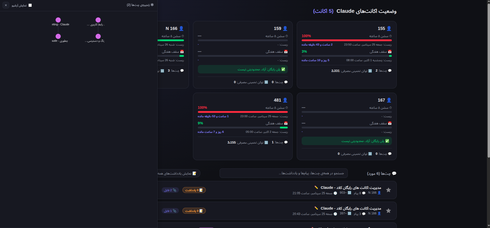

[EN](./README.en.md) | FA
# کلاد مانیتور (Claude Monitor)

ابزاری محلی (Local) برای رصد وضعیت مصرف چند اکانت رایگان Claude (claude.ai) در یک داشبورد واحد. این پروژه از دو بخش تشکیل شده:

1. **اکستنشن مرورگر (Chrome/Chromium/Edge)** — داخل تب‌های باز شده‌ی `claude.ai` اجرا می‌شود، درصد مصرف سشن ۵ ساعته و هفتگی را می‌خواند و به سرور محلی می‌فرستد.
2. **سرور محلی پایتون** — روی سیستم خودتان اجرا می‌شود (`http://localhost:8765`)، اطلاعات همه‌ی اکانت‌هایی که اکستنشن برایش می‌فرستد را ذخیره می‌کند و یک داشبورد وب نمایش می‌دهد.

هیچ داده‌ای به سروری بیرون از سیستم شما ارسال نمی‌شود؛ همه‌چیز کاملاً لوکال است.

---

## قابلیت‌ها

- نمایش درصد مصرف **سشن ۵ ساعته** و **مصرف هفتگی** هر اکانت، به همراه زمان ریست شدن.
- پشتیبانی از **چند اکانت همزمان** (با برچسب دلخواه برای هر کدام، مثلاً `acc1`, `acc2`).
- نمایش لیست چت‌های هر اکانت و برآورد تقریبی تعداد توکن مصرفی هر چت.
- خواندن مستقیم از API داخلی خود claude.ai (با همان کوکی نشست شما)، پس نیازی به وارد کردن پسورد یا توکن جداگانه نیست.
- گوش‌دادن به استریم SSE پیام‌ها برای گرفتن دقیق‌ترین عدد مصرف لحظه‌ای.
- داشبورد وب ساده با کارت جداگانه برای هر اکانت و رنگ‌بندی هشدار (سبز/زرد/قرمز) بر اساس درصد مصرف.
- اجرای خودکار سرور با یک کلیک (آیکون دسکتاپ در لینوکس، فایل اجرایی در ویندوز) بدون نیاز به باز کردن ترمینال هر بار.

---

## پیش‌نیازها

- مرورگر مبتنی بر Chromium: **Google Chrome**, **Microsoft Edge**, **Brave** یا مشابه.
- **Python 3** نصب‌شده روی سیستم (نسخه‌ی ۳٫۸ به بالا کافی است).
- حداقل یک اکانت claude.ai که با آن در مرورگر لاگین کرده‌اید.

---





## نصب و راه‌اندازی — گام به گام

### مرحله ۱: نصب اکستنشن مرورگر

از آنجا که این اکستنشن در Chrome Web Store منتشر نشده، باید آن را به‌صورت «Unpacked» (بارگذاری دستی) نصب کنید:

1. پوشه‌ی پروژه (`claude-monitor`) را از حالت فشرده خارج کنید (اگر zip دریافت کرده‌اید).
2. مرورگر Chrome یا Edge را باز کنید و به آدرس زیر بروید:
   - Chrome: `chrome://extensions`
   - Edge: `edge://extensions`
3. گزینه‌ی **حالت توسعه‌دهنده (Developer mode)** را در گوشه‌ی بالا سمت راست (یا چپ، بسته به زبان مرورگر) روشن کنید.
4. روی دکمه‌ی **Load unpacked** (بارگذاری بسته‌نشده) کلیک کنید.
5. در پنجره‌ی باز شده، پوشه‌ی `extension` داخل پوشه‌ی پروژه را انتخاب کنید (نه کل پروژه، فقط پوشه‌ی `extension`).
6. اکستنشن با نام **Claude Multi-Account Monitor** به لیست اضافه می‌شود. آیکون آن را به نوار ابزار مرورگر Pin کنید تا همیشه در دسترس باشد.

> نکته: اگر فایل‌های اکستنشن را بعداً جابه‌جا یا حذف کنید، باید دوباره از مرحله‌ی ۴ تکرار کنید، چون مرورگر مسیر پوشه را به خاطر می‌سپارد.

#### تنظیم برچسب اکانت

برای هر اکانتی که در مرورگر با آن وارد `claude.ai` می‌شوید (مثلاً در پروفایل‌های مختلف کروم یا حالت Incognito چندگانه):

1. روی آیکون اکستنشن در نوار ابزار کلیک کنید.
2. یک نام دلخواه برای این اکانت وارد کنید (مثلاً `acc1`، `کاری`، `شخصی`).
3. روی **ذخیره** کلیک کنید.

این برچسب فقط برای تشخیص اکانت‌ها در داشبورد شماست و به هیچ سروری غیر از سرور محلی خودتان ارسال نمی‌شود.

### مرحله ۲: راه‌اندازی سرور محلی

#### روش الف) لینوکس

1. ترمینال را در پوشه‌ی پروژه باز کنید.
2. اسکریپت نصب را یک‌بار اجرا کنید:
   ```bash
   bash install.sh
   ```
3. این اسکریپت یک آیکون به نام **Claude Monitor** روی دسکتاپ و در منوی برنامه‌ها می‌سازد.
4. از این به بعد کافی است روی همان آیکون کلیک کنید؛ سرور به‌صورت خودکار (بدون باز شدن ترمینال) اجرا شده و مرورگر پیش‌فرض شما صفحه‌ی داشبورد را باز می‌کند.
5. لاگ اجرای سرور در فایل `/tmp/claude-monitor.log` نوشته می‌شود.

#### روش ب) ویندوز

1. فایل `install.bat` (در همین پکیج ارائه شده) را داخل پوشه‌ی اصلی پروژه (کنار پوشه‌ی `server`) قرار دهید.
2. روی آن دوبار کلیک کنید (یا راست‌کلیک و «Run as administrator» در صورت نیاز — معمولاً لازم نیست).
3. این اسکریپت یک میان‌بر (Shortcut) به نام **Claude Monitor** روی دسکتاپ شما می‌سازد.
4. از این پس با دابل‌کلیک روی همین میان‌بر، سرور به‌صورت مخفی (بدون باز شدن پنجره‌ی سیاه CMD) اجرا شده و داشبورد در مرورگر پیش‌فرض شما باز می‌شود.

> پیش‌نیاز ویندوز: پایتون باید نصب باشد و هنگام نصب گزینه‌ی **Add python.exe to PATH** فعال شده باشد. برای بررسی، در Command Prompt دستور `python --version` را اجرا کنید.

#### روش پ) اجرای دستی (هر سیستم‌عاملی)

اگر نمی‌خواهید از اسکریپت نصب استفاده کنید:

```bash
cd server
python3 server.py
```

سپس در مرورگر به آدرس `http://localhost:8765` بروید.

### مرحله ۳: بررسی اتصال

1. یک تب جدید در claude.ai باز کنید و وارد اکانت شوید.
2. یک پیام به Claude بفرستید یا وارد صفحه‌ی استفاده (Usage) شوید.
3. به داشبورد (`http://localhost:8765`) برگردید و صفحه را رفرش کنید؛ باید کارت مربوط به این اکانت با برچسبی که انتخاب کردید ظاهر شود.
4. اگر چیزی نمایش داده نشد، Console مرورگر را در تب claude.ai باز کنید (کلید F12) و دنبال پیام‌های `[ClaudeMonitor:...]` بگردید تا خطای احتمالی مشخص شود (معمولاً یعنی سرور روشن نیست).

---

## سوالات متداول

**آیا این کار خلاف قوانین Anthropic است؟**
این ابزار فقط داده‌ی مصرف اکانت‌های خود شما را که از طریق نشست لاگین‌شده‌ی مرورگرتان در دسترس است می‌خواند؛ هیچ دور زدن محدودیت یا اتوماسیون ارسال پیام انجام نمی‌دهد. مسئولیت رعایت شرایط استفاده‌ی Anthropic بر عهده‌ی خود کاربر است.

**چرا باید هر بار پورت ۸۷۶۵ باز باشد؟**
سرور و اکستنشن فقط از طریق `localhost:8765` با هم صحبت می‌کنند؛ اگر پورت توسط برنامه‌ی دیگری اشغال شده باشد، در فایل `server/server.py` مقدار `PORT` را تغییر دهید و متناظر آن را در `extension/manifest.json` و `extension/background.js` نیز به‌روزرسانی کنید.

**داده‌ها کجا ذخیره می‌شوند؟**
در فایل `server/status.json` کنار خود سرور، به‌صورت متنی (JSON) و کاملاً روی سیستم شما.
